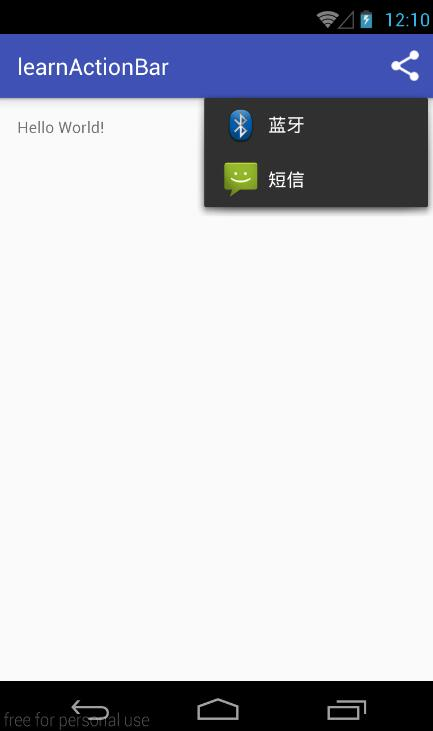

###### 20160519    

## ShareActionProvider   
&nbsp;&nbsp;&nbsp;&nbsp;在ActionBar上使用ActionProvider实现一个高效的友好的分享操作在Android 4.0（API等级14）上更容易了。一个ActionProvider，一旦附加到action bar的菜单上了，就会处理外观和行为上的操作，至于ShareActionProvider，你之需要提供一个share intent，剩下的就交给 ShareActionProvider来做就很容易。<a href="https://developer.android.com/reference/android/widget/ShareActionProvider.html">参考文档</a>

对于Android2.1及以上版本与Android3.0及以上版本，其实现方式有一定的区别。对于Android2.1及以上版本，其实现步骤如下：   
###### ① 创建menu资源文件（menu.xml）  
```html   
<?xml version="1.0" encoding="utf-8"?>
<menu xmlns:android="http://schemas.android.com/apk/res/android"
      xmlns:app="http://schemas.android.com/apk/res-auto">

    <item android:id="@+id/action_share"
        android:title="@string/share"
        app:showAsAction="ifRoom"
        app:actionProviderClass="android.support.v7.widget.ShareActionProvider"/>
</menu>
```   
###### ② 使用menu.xml文件（重写` onCreateOptionsMenu `方法）   
```java  
public class MainActivity extends AppCompatActivity {

    private ShareActionProvider mShareActionProvider;
    @Override
    protected void onCreate(Bundle savedInstanceState) {
        super.onCreate(savedInstanceState);
        setContentView(R.layout.activity_main);
    }

    @Override
    public boolean onCreateOptionsMenu(Menu menu) {
        getMenuInflater().inflate(R.menu.menu, menu);
        MenuItem shareItem = menu.findItem(R.id.action_share);
        mShareActionProvider = (ShareActionProvider) MenuItemCompat.getActionProvider(shareItem);
        mShareActionProvider.setShareIntent(getDefaultIntent());
        return super.onCreateOptionsMenu(menu);
    }

    private Intent getDefaultIntent () {
        Intent intent = new Intent(Intent.ACTION_SEND);
        intent.setType("image/*");
        return intent;
    }
}
```    
###### 实现效果   
   

   


对于Android3.0及以上版本，其实现方式更为简单，实现步骤大体相似，如下：    
###### ① 创建menu资源文件（menu.xml）  
```html   
<?xml version="1.0" encoding="utf-8"?>
<menu xmlns:android="http://schemas.android.com/apk/res/android">

    <item 
        android:id="@+id/action_share"
        android:title="@string/share"
        android:showAsAction="ifRoom"
        android:actionProviderClass="android.widget.ShareActionProvider"/>
</menu>
```   
###### ② 使用menu.xml文件（重写` onCreateOptionsMenu `方法）   
```java  
public class MainActivity extends AppCompatActivity {

    private ShareActionProvider mShareActionProvider;
    @Override
    protected void onCreate(Bundle savedInstanceState) {
        super.onCreate(savedInstanceState);
        setContentView(R.layout.activity_main);
    }

    @Override
    public boolean onCreateOptionsMenu(Menu menu) {
        getMenuInflater().inflate(R.menu.menu, menu);
        MenuItem shareItem = menu.findItem(R.id.action_share);
        mShareActionProvider = (ShareActionProvider) shareItem.getActionProvider();
        mShareActionProvider.setShareIntent(getDefaultIntent());
        return super.onCreateOptionsMenu(menu);
    }

    private Intent getDefaultIntent () {
        Intent intent = new Intent(Intent.ACTION_SEND);
        intent.setType("image/*");
        return intent;
    }
}
```    
稍微的看一眼就能知道区别所在，即在menu.xml文件中，命名空间有细微的区别，actionProviderClass不同，在Java代码中获取ActionProvider的方式有所不同。

