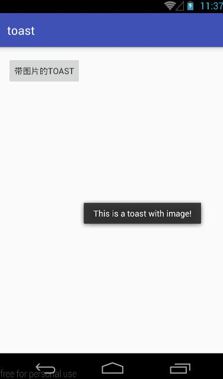
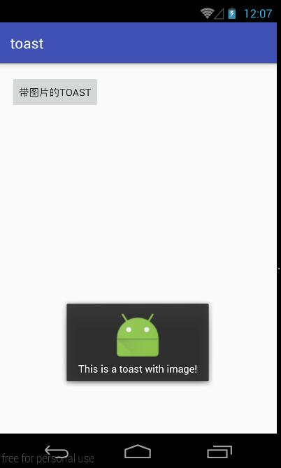
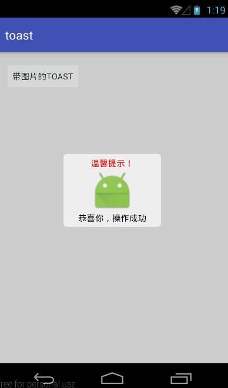

###### 20160523  

##  Toast信息提示   
Toast弹出提示在Android中十分常见，与dialog不一样的是，Toast是没有焦点的，而且Toast显示时间有限，过一定的时间就会消失，且Toast主要用于向用户显示提示消息。  

#### 一、默认Toast样式   
```java  
Toast.makeText(getApplicationContext(),"默认样式", Toast.LENGTH_SHORT).show();
```  
Toast的静态方法` makeText ` 共有三个参数，分别是context，text，duration    
* context： 显示Toast的上下文    
* text：Toast中显示的文本内容      
* duration：Toast显示持续的时间    

注意：在执行完` makeText `方法后一定要执行`show() `方法方可显示Toast。    

#### 二、自定义位置的Toast    
```java   
Toast toast = Toast.makeText(getApplicationContext(), "This is a toast with image!", Toast.LENGTH_LONG);
toast.setGravity(Gravity.CENTER,100,100);
toast.show();
```   
   

#### 三、带图片的Toast   
```java   
Toast toast = Toast.makeText(getApplicationContext(), "This is a toast with image!", Toast.LENGTH_LONG);
LinearLayout toastView = (LinearLayout) toast.getView();
ImageView imageView = new ImageView(getApplicationContext());
imageView.setImageResource(R.drawable.ic_launcher);
toastView.addView(imageView, 0);
toast.show();
```   
   

#### 四、自定义Toast    
```java   
LayoutInflater inflater = LayoutInflater.from(getApplicationContext());
View view = inflater.inflate(R.layout.toast, null);
TextView title = (TextView) view.findViewById(R.id.toast_title);
TextView content = (TextView) view.findViewById(R.id.toast_content);
title.setText("温馨提示！");
title.setGravity(Gravity.CENTER);
title.setTextColor(Color.RED);
content.setText("恭喜你，操作成功");
content.setTextColor(Color.BLACK);
content.setGravity(Gravity.CENTER);

Toast toast = new Toast(getApplicationContext());
toast.setGravity(Gravity.CENTER, 0, 0);
toast.setDuration(Toast.LENGTH_LONG);
toast.setView(view);
toast.show();
```      
###### 布局文件toast.xml    
```html  
<?xml version="1.0" encoding="utf-8"?>
<LinearLayout xmlns:android="http://schemas.android.com/apk/res/android"
    android:layout_height="110dp"
    android:layout_width="150dp"
    android:orientation="vertical"
    android:background="@drawable/toast_background">

    <TextView
        android:layout_width="150dp"
        android:layout_height="20dp"
        android:id="@+id/toast_title"
        android:text=""/>
    <ImageView
        android:id="@+id/imageView"
        android:layout_width="70dp"
        android:layout_height="70dp"
        android:layout_marginLeft="40dp"
        android:background="@drawable/ic_launcher" />
    <TextView
        android:id="@+id/toast_content"
        android:layout_width="150dp"
        android:layout_height="20dp"
        android:text=""/>
</LinearLayout>
```   


