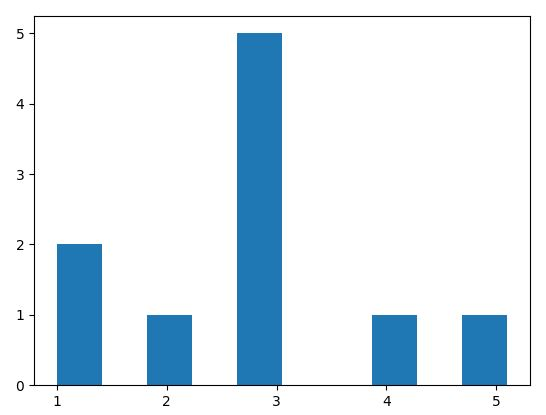
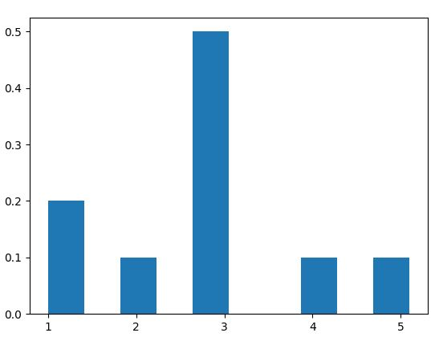

20170712

## Matplotlib绘制直方图   

在matplotlib中提供了` hist() ` 函数绘制直方图，` hist() ` 函数参数比较多，几个重要的参数如下：  
` arr `: 需要用于绘制直方图的 一维数组   
` bins `: 直方图的柱数，默认是10   
` normed `: 直方图向量归一化，默认是False     
```python  
import matplotlib.pyplot as plt

data = [1, 1, 2, 3, 3, 3, 3, 3, 4, 5.1]
plt.hist(data)
plt.show()
```   
  

有的时候我们需要用纵坐标显示每个组出现的比例，因此需要做一些处理   
```python  
import numpy as np
import matplotlib.pyplot as plt

data = [1, 1, 2, 3, 3, 3, 3, 3, 4, 5.1]
weight = np.ones_like(data) / float(len(data))
plt.hist(data, weights=weight)
plt.show()
``` 
  