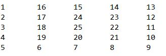

###### 2016031701  
---  
##### 01. 题目描述 ：随机输入一个正整数n，打印出一个n*n的螺旋矩阵，例如,当输入n=5时，输出结果如下： 

  

##### 题目分析：很显然，本题需要创建一个二维数组，关键在于如何按逆时针给数组赋值。稍加分析可以知道，每一轮循环有四个方向，即向下、向右、向上、向左。第一轮循环的起点是a[0][0],最后一轮循环的起点是a[n/2][n/2],总共循环（n+1）/2轮。每一轮循环中，需要判断是否到达边界，当前元素是否为0，必须满足当前循环未达边界并且当前元素为0，如果条件不满应立即转向。  

```java  
import java.util.Scanner;

public class PrintNum {
	
	public static void init(int[][] a, int n) {
		int count = 1;
		int i = 0;
		
		/**
		 * 每一次循环的起点为a[i][i] ,最后一次为a[n/2][n/2];
		 * 每一轮四次循环，即四个方向，向下，向右，向上，向左;
		 * 每个方向进行遍历时，必须满足当前循环未达边界并且当前元素为0，如果条件不满应立即转向;
		 */
		while (i<= n/2) {
			int j = i;
			int k = i;
			
			//向下遍历
			while(j<n && a[j][k] == 0) a[j++][k] = count++;
			j--;     //回退一步
			k++;     //向右转向
			
			//向右遍历
			while(k<n && a[j][k] == 0) a[j][k++] = count++;
			k--;     //回退一步
			j--;     //向上转向
			
			//向上遍历
			while(j>=0 && a[j][k] == 0) a[j--][k] = count++;
			j++;     //回退一步
			k--;     //向左转向
			
			//向左遍历
			while(k>=0 && a[j][k] == 0) a[j][k--] = count++;
			
			i++;	//执行下一轮循环
		}
	}
	
	public static void output(int[][] a,int n) {
		for(int m=0; m<n; m++) {
			for(int c=0; c<n; c++) {
				System.out.print(a[m][c]+"\t");
			}
			System.out.println("");
		}
	}

	public static void main(String[] args) {

		Scanner in = new Scanner(System.in);
		int n = in.nextInt();
		int[][] a = new int[n][n];
		init(a,n);
		output(a,n);	
	}

}
```  