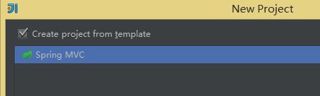

###### 2016-02-27
---
### Maven项目的简单配置  
#### 1 Maven的下载与安装  
##### 1.1 Maven的下载  
&nbsp;&nbsp;&nbsp;&nbsp;Maven是基于项目对象模型(POM)，可以通过一小段描述信息来管理项目的构建，报告和文档的软件项目管理工具。要采用Maven来管理项目首先需要下载Maven按住啊那个文件。下载网址[] http://maven.apache.org/download.cgi。 如下载 apache-maven-3.3.9-bin.zip.  
##### 1.2 Maven安装   
&nbsp;&nbsp;&nbsp;&nbsp; 下载好上述Zip文件后，需要指定路径进行解压。如 ` D:\maven\apache-maven-3.3.9 `。
接下来就是进行所谓的安装了。即配置系统环境变量 ：  
###### MAVEN_HOME = D:\maven\apache-maven-3.3.9  
###### path = ;%MAVEN_HOME%\bin   
&nbsp;&nbsp;&nbsp;&nbsp; 安装完后需要检查是否安装成功。打开cmd，运行 ` mvn -v ` 命令，若显示Maven版本信息则表明成功，否则，安装失败。如下图所示：  

   

##### 1.3 修改Maven本地仓库位置  
&nbsp;&nbsp;&nbsp;&nbsp; 如果不修改本地仓库位置，Maven将默认把依赖文件存放在c盘用户目录m2文件夹下。所以我们需要修在配置文件来避免这个问题。即修改config目录下的` settings.xml ` 。  
```java  
<localRepository>D:/maven/repository</localRepository>  
```  
#### 2 Maven 管理javaweb项目  
&nbsp;&nbsp;&nbsp;&nbsp; 以IDEA 14为例讲解如何配置Maven管理javaweb项目。 首先，新建一个项目 ` File->New->Project ` ，选择新建一个SpringMVC的项目。如下图  

   

   

   


