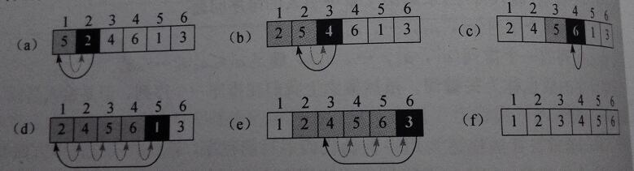

###### 20160320   
---  

## 排序算法  

&nbsp;&nbsp;&nbsp;&nbsp;排序总的分为简单排序、快速排序、堆排序、归并排序、基数排序这几种，不同的排序算法有不同的应用场景，各自的排序效率也不相同。为简化排序代码，提高代码的可重用性，特编写一下排序工具类。  
###### SortUti.java  
```java  
/**
 * Created by ljf-梁燕双栖 on 2016/3/19.
 */
public class SortUtil {

    /**
     * 如果v<w,结果返回为true，否则为false
     * @param v
     * @param w
     * @return
     */
    public boolean less(Comparable v, Comparable w) {
        return  v.compareTo(w) < 0 ;
    }

    /**
     * 交换数组中元素
     * @param a
     * @param i
     * @param j
     */
    public void exch(Comparable[] a, int i, int j) {
        Comparable t = a[i];
        a[i] = a[j];
        a[j] = t;
    }

    public void show(Comparable[] a) {
        for(Comparable c : a) {
            System.out.print(c+"\t");
        }
    }
}  
```  
&nbsp;&nbsp;&nbsp;&nbsp;为了更直观的比较各种算法的性能，需要自定义一个比较类，如下` SortCompare.java `,此时需要将` stdlib.jar ` 导入到项目的lib中。  
###### SortCompare.java  
```java  
package sort;

import com.algs4.stdlib.StdDraw;
import com.algs4.stdlib.StdRandom;
import com.algs4.stdlib.Stopwatch;


/**
 * Created by ljf-梁燕双栖 on 2016/3/20.
 */
public class SortCompare {

    public static double time(String alg, Comparable[] a) {
        
        Stopwatch timer = new Stopwatch();
        if (alg.equals("InseerSort")) InseerSort.sort(a);
        if (alg.equals("ShellSort")) ShellSort.sort(a);
        if (alg.equals("SelectSort")) InseerSort.sort(a);
        if (alg.equals("MergeSort")) ShellSort.sort(a);

        return timer.elapsedTime();
    }

    /**
     * description: 使用alg算法将T个长度为N的数组排序
     * @param alg ： 算法类名
     * @param N ： 数组长度
     * @param T ： 数组个数
     * @return ： 完成排序需要的总时间
     */
    public static double timeRandomInput(String alg, int N, int T) {

        double total = 0.0;
        Double[] a = new Double[N];
        for (int t =0; t < T; t++) {
            for (int i = 0; i<N; i++)
                a[i] = StdRandom.uniform();
            total += time(alg, a);
        }
        return total;
    }

    public static void main(String[] args) {

        System.out.printf("MergeSort: %.5f \n", timeRandomInput("MergeSort", 10000, 100));
        System.out.printf("SelectSort: %.5f \n", timeRandomInput("SelectSort", 10000, 100));
        System.out.printf("InseerSort: %.5f \n",timeRandomInput("InseerSort", 10000, 100));
        System.out.printf("ShellSort: %.5f \n", timeRandomInput("ShellSort", 10000, 100));
    }

}
```  
#### 1 简单排序  
##### 1.1 插入排序  
&nbsp;&nbsp;&nbsp;&nbsp;插入排序属于简单排序中的一种，主要原理是从待排序列的第二个元素开始，与前一个元素比较，如果后一个元素比前一个元素小（以从小到大排序为例），则交换两个元素的位置，继续与前一个比较，直到整个序列完全有序。  

  

###### 实现
```java  
/** 插入排数： 从第二个点开始，一直与前面一个点比较，若后面点比前面点小，就将小的点前移，
 *            继续与前面的点比较直到比前面的点大
 *  最好情况 ：待排序的元素已经有序
 *  最坏情况 ：待排序元素时逆序的
 *
 * Created by ljf-梁燕双栖 on 2016/3/19.
 */
public class InseerSort {

    static SortUtil util = new SortUtil();
    public static void sort(Comparable[] a) {
        int N = a.length;
        for (int j =1 ; j<N; j++) {
            int i = j -1;
            Comparable key = a[j];
            while (i>=0 && util.less(key, a[i])) {
                a[i+1] = a[i];
                a[i] = key;
                i--;
            }
        }
    }

    public static void main(String[] args) {

        Integer[] a = {5,7,4,3,6,2,10,12,11};
        sort(a);
        util.show(a);
    }
}
```  

##### 1.2 选择排序  
&nbsp;&nbsp;&nbsp;&nbsp; 选择排序的原理是在待排序列中找到最小的那个元素，与序列中第一个元素交换位置，再在剩下的元素中找到最小的元素与，与序列中的第二个元素交换位置，如此往复，直到整个序列有序。  
```java  
/**
 * Created by ljf-梁燕双栖 on 2016/3/19.
 */
public class SelectSort {
    static SortUtil util = new SortUtil();
    public static void sort(Comparable[] a) {
        int N = a.length;
        for(int i = 0; i<N; i++) {
            int min = i;
            for(int j = i+1; j<N; j++)
                if (util.less(a[j],a[min])) min = j;
            util.exch(a,i,min);
        }
    }
    public static void main(String[] args) {

        Integer[] a = {1,5,3,6,8,7,4};
        sort(a);
        util.show(a);
    }

}
```  
##### 1.3 希尔排序  
&nbsp;&nbsp;&nbsp;&nbsp;希尔排序是一种基于插入排序的快速的排序算法。对于大规模的乱序数组，插入排序很慢，因为插入排序只能交换相邻的元素，因此元素只能慢慢的从待排序列的一端移动到另一端。希尔排序为了加快移动速度简单的改进了插入排序，交换不相邻的元素以对数组的局部进行排序，并最终用插入排序将局部有序的数组排序。  
&nbsp;&nbsp;&nbsp;&nbsp;希尔排序的思想是使数组中任意间隔为h的元素都是有序的，h从N/3递减至1，算法的性能不仅取决于h，还取决于h之间的数学性质。  
```java  
package sort;

/**
 * Created by ljf-梁燕双栖 on 2016/3/20.
 */
public class ShellSort {

    static SortUtil util = new SortUtil();

    public static void sort(Comparable[] a) {
        int N = a.length;
        int h = 1;
        while (h < N/3) h = 3*h + 1;
        while (h >= 1) {
            for (int i = 0; i < N; i++) {
                for (int j =i; j >=h && util.less(a[j], a[j-h]); j-=h)
                    util.exch(a,j,j-h);
            }
            h /= 3;
        }
    }

    public static void main(String[] args) {
        Double[] a = {4.9,3.8,6.5,.97,7.6,1.3,2.7,5.5};
        sort(a);
        util.show(a);
    }
}
```  

###### 算法分析  
&nbsp;&nbsp;&nbsp;&nbsp;简单排序的平均时间复杂度为O（n2）(即O(n*n))，空间复杂度为O(1)，当序列中的记录基本有序或者总体规模n较小时，它是最佳的排序方法；最坏的情况是待排序列是逆序的，最坏情况的时间复杂度也为O(n2).


